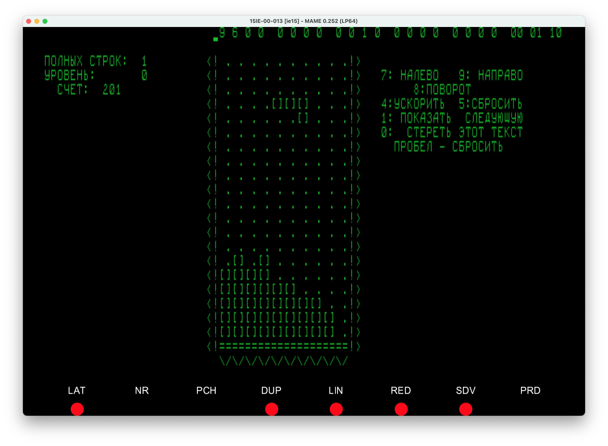

# Run Original Tetris by Alexey Pajitnov on your Computer



In light of the latest movie [about the history of Tetris][4], I decided to
try and play the original version of the game.  I was surprised to find that
it was not available on any of the major platforms.  I was able to find a
version of the game that runs on the MAME emulator, and get it running on my
Mac, sharing the process here in case it helps anyone else.

The solution is based on the [original instructions][5], and the [SDL MAME
tutorial][6].  The only changes I made are:

- dockerized the build process to ensure a consistent environment;
- used the latest version of MAME (0.252);

## Architecture

```
+---- docker --------------------+  +--- MAME ----+      \o 
| SIMH(PDP-11): localhost:2323 <-+--+-15ИЭ-00-013 | <--   |\
+--------------------------------+  +-------------+       Л
          (backend)                   (frontend)        (you)
```

## Prerequistes

1. Download and install docker from [Official docker website][9]
2. Open the Terminal.app if you're on Mac or Linux, or PowerShell if you're
   on Windows.
3. Go to your usual working directory, e.g.:

       cd ~/projects

   or create one if you don't have it:

         mkdir ~/projects
         cd ~/projects

3. Clone this repository:

       git clone https://github.com/corkscrewey/soviet-tetris.git

   This will create a `soviet-tetris` directory in your working directory.

4. Go to the `soviet-tetris` directory:

       cd soviet-tetris

## Quickstart (easy-run)

WIP


## Quickstart (manual)

### build docker compose image
Ensure that you're in the same directory as the `docker-compose.yml` file.

    docker compose build

This will build the docker image that will run the PDP-11 simulator.

### Install MAME

MAME is a multi-platform emulator that can emulate a wide variety of
computers, consoles, and arcade machines.  It is available for Linux, Mac,
and Windows.  We will use it to emulate the 15ИЭ-00-013 terminal.

#### Linux
1. If you're on Ubuntu, you can do this with:

       sudo apt install mame

   If you're on Gentoo, you most likely know what to do.

#### Mac 
1. Download the SDL framework from [SDL Releases page][3] (`SDL2-2.26.4.dmg` or
   later)
2. Unpack SDL to `/Library/Frameworks`
3. Get the latest MAME:
   - **Intel:** Get the latest [Mame for Intel][1] (discovered though comments
     on [this][2] page)
   - **Apple Silicon:** Get the latest [MAME for apple silicon][8]
4. Unpack the zip file to ./mame

#### Windows
1. Get the latest release of [MAME][7]
2. Install MAME onto your system by running the downloaded installer.

## Run
Automatic (macOS or Linux):

    make

Manual:

1. Start the PDP-11 simulator:

       docker compose up -d

   This will start the SimH simulating PDP-11, and expose the serial port on
   `localhost:2323`.  It will wait for connection from the terminal.

   Precise build instructions are in Dockerfile, if you're of an inquisitive
   type.

2. Start the MAME emulator that emulates 15ИЭ-00-013 terminal:

       ./mame/mame ie15 -rompath files/rom -window -rs232 null_modem -bitb socket.localhost:2323

   This will instruct MAME to emulate the 15ИЭ-00-013 terminal, and connect
   it's RS232 "port" to the PDP-11 simulator using bitbanger connection to
   localhost:2323.  The `-window` option will start the emulator in a
   separate window.

   On windows, you may need to include the full path to the mame executable, or
   add it to your PATH environment variable.

3. Once MAME connects, you will see a welcome message, and a prompt, which
   looks like a dot ".".  Now type:

         RUN DL1:TETRIS

   And press Enter.

   The terminal has a non-standard keymap, so to type the colon character ":",
   you need to press `[']` key (on US keyboard, it's to the left of Enter or
   Return key).

There are some other games on the DL1: disk, to view them all, type:

    DIR DL1:*

The "*" character can be entered by pressing `[Shift]+[']` keys.

## Other References
1. https://retrogamesultra.com/2019/02/24/running-the-mame-arcade-emulator-on-mac-os-x/
2. https://wiki.mamedev.org/index.php/SDL_Supported_Platforms

## License
This work is licensed under the Creative Commons Attribution-ShareAlike 4.0

Disk images are mirrored from:
- http://astio.ciotoni.net/tetris/rl0.dsk (PDP system image with RT-11 OS)
- http://astio.ciotoni.net/tetris/games.dsk

as per original instructions.

[1]: https://www.mediafire.com/file/zbo90w4rvfey9gb/mame_252.zip/file
[2]: https://sdlmame.lngn.net/2023/02/23/mame-0-252-released/
[3]: https://github.com/libsdl-org/SDL/releases/
[4]: https://tv.apple.com/us/movie/tetris/umc.cmc.4evmgcam356pzgxs2l7a18d7b
[5]: https://lab.dyne.org/OriginalTetrisHowto
[6]: http://bamf2048.github.io/sdl_mame_tut/
[7]: https://github.com/mamedev/mame/releases/download/mame0253/mame0253b_64bit.exe
[8]: https://sdlmame.lngn.net/stable/mame0252-arm64.zip
[9]: https://www.docker.com/products/docker-desktop/
